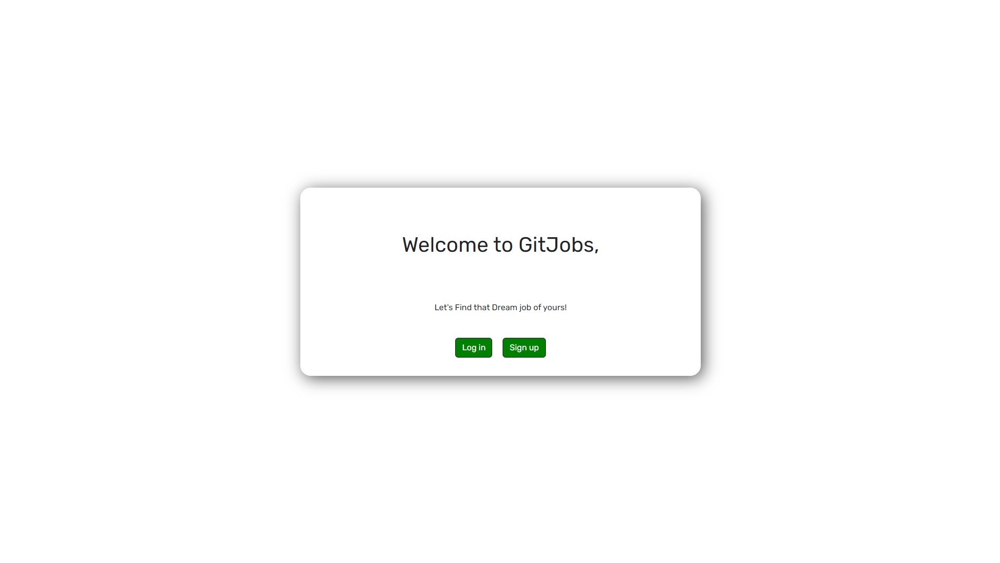
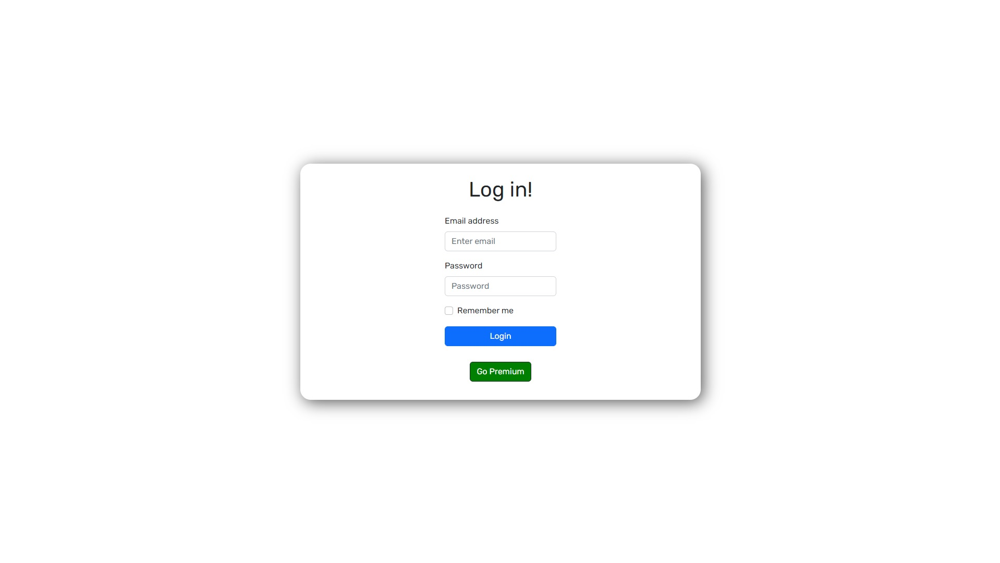
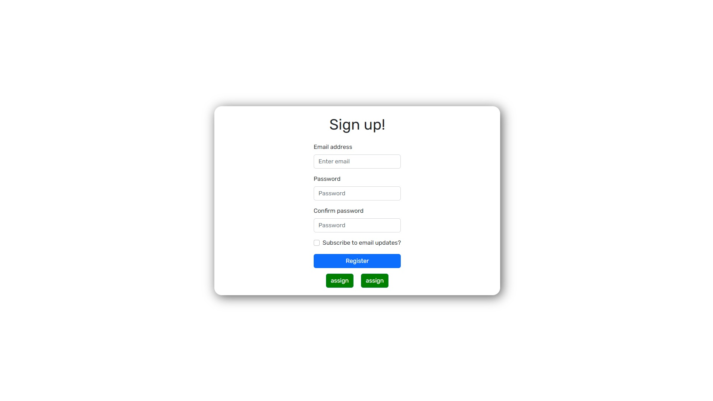
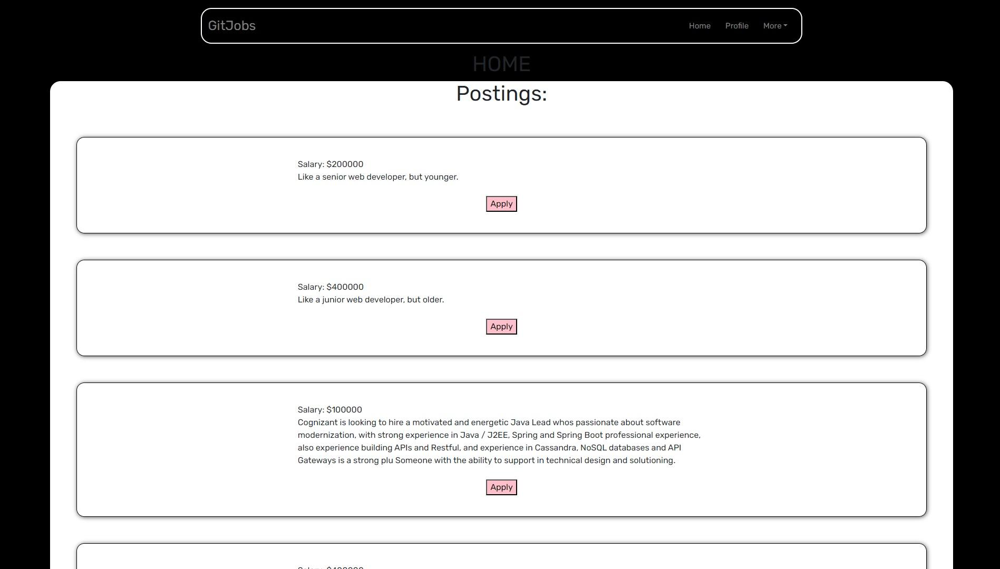

# GitJobs

<<<<<<< HEAD
## Description

Provide a short description explaining the what, why, and how of your project. Use the following questions as a guide:

- What was your motivation?
- The motivation to build this application was to create a way to search for a new career.
- Why did you build this project? (Note: the answer is not "Because it was a homework assignment.")
- This project was built to connect the employer to the employee and further everones economic position.
- What problem does it solve?
- This application solves thr problem of not having a job board with a job for you.
- What did you learn?
- In the process of building this application I learned the process of building a react app, connecting it to mongodb, jwt authentication, and heroku deployment.

## Table of Contents (Optional)

If your README is long, add a table of contents to make it easy for users to find what they need.

- [Installation](#installation)
- [Usage](#usage)
- [Credits](#credits)
- [Links](#links)

## Installation

run 'npm i' 'npm run develop'

## Usage

## Credits
Joshua Aguirre:
https://github.com/jshvaron

Dillon Lindstrom
https://github.com/lindstdb

Jose Manuel Soltero
https://github.com/jmsoltero

Christopher Newell
https://github.com/Arms-like-trees

## Links

GitHub Repo: https://github.com/Group4-finalPoject/project_job_board

Deployed Application: 
=======
stuff more
>>>>>>> 3869fd11026e940ed91221b3abaddfe52de96a06
